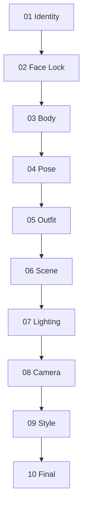

# Reference Fusion System

<p align="center">

AI image production workflow using modular reference fusion.

</p>

---

## 🌐 Languages

[🇺🇸 English](README.md) | 

---

## What is RFW?

**Reference Fusion Workflow (RFW)** is a structured, identity-preserving reference assignment framework for multimodal image generation.

Instead of mixing multiple reference images into a single prompt, RFW assigns **one clear visual responsibility** to each reference image:

> **Identity → Body → Pose → Outfit → Scene → Lighting → Camera → Style**

By isolating each visual attribute, RFW makes character generation more predictable, reproducible, and easier to iterate.

**Benefits**

- More consistent character identity
- Controlled visual editing
- Reduced reference conflicts
- Easier iterative refinement

> Optimized for **Nano Banana**, but designed to work with any image model that supports multiple reference images, including **GPT Image**, **Flux Kontext**, **Gemini Image**, and future models.

---

# Design Philosophy

RFW follows one simple principle:

> **Every reference image should have exactly one primary responsibility.**

When multiple reference images compete for the same visual attributes, image models often produce inconsistent results, including identity drift, body distortion, or unintended style transfer.

By assigning a single responsibility to each reference image, every generation step becomes more predictable, modular, and reproducible.

---

# Why this exists

Many multi-reference workflows assign several visual responsibilities to every reference image.

This often leads to:

- Face drift
- Body proportion changes
- Outfit bleeding into facial identity
- Scene references overriding the character
- Unpredictable generation results

RFW addresses these issues by enforcing a **sequential responsibility chain**, where each stage modifies only one visual dimension while preserving everything established in earlier stages.

```
Identity → Face Lock → Body → Pose → Outfit → Scene → Lighting → Camera → Style → Final
```

Earlier stages establish immutable attributes.

Later stages refine only isolated visual dimensions.

---

# Quick Start

1. Read **docs/architecture.md** to understand the design principles.
2. Follow **docs/workflow.md** to execute the workflow.
3. Use the prompts in **prompts/** (one file per stage).
4. If something goes wrong, see **docs/failure-recovery.md**.

---

# Core Pipeline

Each stage produces a reusable **Master Reference** for the next stage.



| Stage | Responsibility | Output |
|-------|----------------|--------|
| 01 Identity | Facial identity | `Identity_Master_v1` |
| 02 Face Lock | Restore identity consistency | `Face_Locked_Master_v1` |
| 03 Body | Body proportions | `Body_Master_v1` |
| 04 Pose | Body position & gesture | `Pose_Master_v1` |
| 05 Outfit | Clothing & accessories | `Fashion_Master_v1` |
| 06 Scene | Environment | `Scene_Master_v1` |
| 07 Lighting | Lighting & mood | `Lighting_Master_v1` |
| 08 Camera | Lens & composition | `Camera_Master_v1` |
| 09 Style | Overall aesthetic | `Style_Master_v1` |
| 10 Final | Realism enhancement | `Final_Master_v1` |

---

# Reference Priority Matrix

The workflow follows one rule:

> **Each reference image owns one visual responsibility.**

| Stage | Primary Responsibility | Preserve | Ignore |
|------|-------------------------|----------|--------|
| Identity | Facial identity | — | Everything else |
| Face Lock | Facial identity | Body, pose, outfit | Background |
| Body | Body proportions | Face & identity | Face of body reference |
| Pose | Pose & skeleton | Face & body | Identity of pose reference |
| Outfit | Clothing | Face, body & pose | Face of outfit reference |
| Scene | Environment | Entire character | Characters in scene reference |
| Lighting | Lighting & mood | Everything else | — |
| Camera | Composition | Everything else | — |
| Style | Overall aesthetic | Everything else | — |
| Final | Image quality | Everything | — |

---

# Repository Structure

```
nano-banana-rfw/
├── README.md
├── prompts/
│   ├── 01_identity.md
│   ├── 02_face_lock.md
│   ├── 03_body.md
│   ├── 04_pose.md
│   ├── 05_outfit.md
│   ├── 06_scene.md
│   ├── 07_lighting.md
│   ├── 08_camera.md
│   ├── 09_style.md
│   └── 10_final.md
├── docs/
│   ├── architecture.md
│   ├── workflow.md
│   ├── failure-recovery.md
│   ├── best-practices.md
│   └── limitations.md
└── examples/
    ├── identity/
    ├── body/
    ├── pose/
    └── full-pipeline/
```

---

# Best Practices

- Assign one responsibility to each reference image.
- Use high-resolution reference images whenever possible.
- Keep camera angle and focal length reasonably similar.
- Use neutral lighting for identity and body references.
- Always feed the previous **Master** output as Image 1 for the next stage.

See **docs/best-practices.md** for additional recommendations.

---

# Limitations

RFW improves consistency, but cannot guarantee:

- Perfect identity preservation across all image models
- Pixel-perfect clothing reproduction
- Exact hand or finger positioning
- Identical camera framing

Results depend on the capabilities of the underlying image model and the quality of the reference images.

See **docs/limitations.md** for more details.

---

# Contributing

Contributions are welcome, including:

- Improved prompts
- Recovery strategies
- Model-specific recommendations
- Workflow enhancements
- Documentation improvements

Please preserve the core design principle:

> **One reference image. One responsibility.**

---

*Reference Fusion Workflow (RFW) — Consistent characters through structured reference assignment.*
