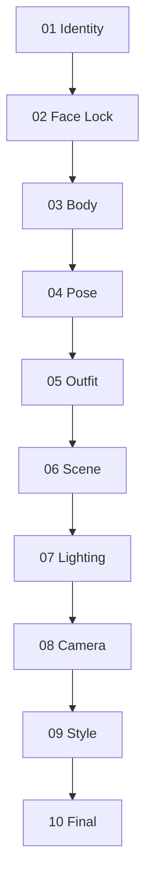

# Reference Fusion Workflow (RFW)

**A structured, identity-preserving reference assignment framework for multimodal image generation.**

Instead of mixing multiple reference images into a single prompt,  
RFW assigns **one clear responsibility** to each reference image  
(identity · body · pose · outfit · scene · lighting · style).

The result: higher character consistency + controlled, isolated modifications.

> Optimized for **Nano Banana**, but designed to work with any model that supports multi-reference image input  
> (GPT Image · Flux Kontext · Gemini Image · and future models).

---

## Why this exists

Most people dump every reference image into one prompt and hope for the best.

That usually causes:

- face drift
- body proportion collapse
- outfit bleeding into identity
- scene overriding the character

RFW solves this by enforcing a **strict sequential responsibility chain**:

```
Identity  →  Face Lock  →  Body  →  Pose  →  Outfit  →  Scene  →  Lighting  →  Camera  →  Style  →  Final
```

Earlier stages lock immutable attributes.  
Later stages only modify isolated visual dimensions.

---

## Quick Start

1. Read [docs/architecture.md](docs/architecture.md) — understand the design principles
2. Follow [docs/workflow.md](docs/workflow.md) — step-by-step execution
3. Copy prompts from [`prompts/`](prompts/) — one file per step
4. Check [docs/failure-recovery.md](docs/failure-recovery.md) when something breaks

---

## Core Pipeline



| Stage | Responsibility | Output |
|-------|----------------|--------|
| 01 Identity | Facial identity | `Identity_Master_v1` |
| 02 Face Lock | Correct identity drift | `Face_Locked_Master_v1` |
| 03 Body | Body proportions | `Body_Master_v1` |
| 04 Pose | Body position & gesture | `Pose_Master_v1` |
| 05 Outfit | Clothing & accessories | `Fashion_Master_v1` |
| 06 Scene | Environment | `Scene_Master_v1` |
| 07 Lighting | Light & mood | `Lighting_Master_v1` |
| 08 Camera | Lens & composition | `Camera_Master_v1` |
| 09 Style | Aesthetic lock | `Style_Master_v1` |
| 10 Final | Realism polish | `Final_Master_v1` |

---

## Reference Priority Matrix

| Step | Highest Priority | Must Preserve | Must Ignore |
|------|------------------|---------------|-------------|
| Identity | Face | — | Everything else |
| Face Lock | Face | Body / Pose / Outfit | Background changes |
| Body | Body proportions | Face + Identity | Face of body ref |
| Pose | Skeleton / pose | Face + Body proportions | Identity of pose ref |
| Outfit | Clothing | Face + Body + Pose | Face of outfit ref |
| Scene | Background | Character entirely | Character of scene ref |
| Lighting | Light & mood | Everything else | — |
| Camera | Framing | Everything else | — |
| Style | Aesthetic | Everything else | — |
| Final | Quality only | Everything | — |

---

## Repository Structure

```
nano-banana-rfw/
├── README.md
├── prompts/
│   ├── 01_identity.md
│   ├── 02_face_lock.md
│   ├── 03_body.md
│   ├── 04_pose.md
│   ├── 05_outfit.md
│   ├── 06_scene.md
│   ├── 07_lighting.md
│   ├── 08_camera.md
│   ├── 09_style.md
│   └── 10_final.md
├── docs/
│   ├── architecture.md
│   ├── workflow.md
│   ├── failure-recovery.md
│   ├── best-practices.md
│   └── limitations.md
└── examples/
    └── (before/after placeholders)
```

---

## Best Practices (Summary)

- One responsibility per reference image
- High-resolution references
- Similar camera angle & focal length between character and reference
- Neutral lighting on identity/body references when possible
- Always feed the previous Master as Image 1

See [docs/best-practices.md](docs/best-practices.md) for the full list.

---

## Limitations

This workflow **cannot guarantee**:

- Perfect identity preservation across every model
- Exact clothing reproduction
- Exact hand / finger pose
- Exact camera angle matching

Performance heavily depends on the underlying image model and reference quality.

See [docs/limitations.md](docs/limitations.md).

---

## Contributing

Improvements to prompts, recovery strategies, or model-specific tips are welcome.  
Please keep the core principle: **one responsibility per reference**.

---

*Reference Fusion Workflow (RFW) — identity-preserving generation by design*
