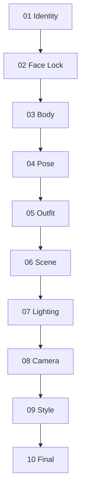

# Reference Fusion System

<p align="center">

モジュール型リファレンス融合による AI 画像制作ワークフロー。

</p>

---

## 🌐 Languages

[🇺🇸 English](README.md) | [🇹🇼 繁體中文](README_zh-TW.md) | [🇨🇳 简体中文](README_zh-CN.md) | [🇯🇵 日本語](README_ja.md)

---

## RFW とは？

**Reference Fusion Workflow (RFW)** は、マルチモーダル画像生成のための、構造化されたアイデンティティ保持型リファレンス割り当てフレームワークです。

複数の参照画像を 1 つのプロンプトに混在させる代わりに、RFW では各参照画像に対して**1 つの明確な視覚的責任**を割り当てます。

> **Identity → Body → Pose → Outfit → Scene → Lighting → Camera → Style**

各視覚属性を分離することで、RFW はキャラクター生成をより予測可能、再現可能にし、反復調整を容易にします。

**メリット**

* より一貫したキャラクターアイデンティティ
* 制御可能なビジュアル編集
* リファレンス間の競合を削減
* より容易な反復改善

> **Nano Banana** 向けに最適化されていますが、複数の参照画像をサポートするあらゆる画像モデルで利用できるよう設計されています。対象には **GPT Image**、**Flux Kontext**、**Gemini Image**、および将来のモデルが含まれます。

---

# 設計思想

RFW は 1 つのシンプルな原則に従います。

> **すべての参照画像は、必ず 1 つだけの主要な責任を持つべきである。**

複数の参照画像が同じ視覚属性を競合して制御しようとすると、画像モデルはアイデンティティの変化、身体の歪み、意図しないスタイル転送など、一貫性のない結果を生成することがあります。

各参照画像に単一の責任を割り当てることで、すべての生成ステップはより予測可能で、モジュール化され、再現可能になります。

---

# なぜこれが存在するのか

多くのマルチリファレンスワークフローでは、各参照画像に複数の視覚的責任を割り当てています。

これにより、以下の問題が発生しやすくなります。

* 顔の変化
* 身体比率の変化
* 服装要素が顔のアイデンティティへ混入
* シーン参照がキャラクターを上書き
* 予測不能な生成結果

RFW は、**段階的責任チェーン**を適用することでこれらの問題に対応します。各ステージでは 1 つの視覚的次元のみを変更し、それ以前のステージで確立された内容を保持します。

```
Identity → Face Lock → Body → Pose → Outfit → Scene → Lighting → Camera → Style → Final
```

初期ステージでは変更不可能な属性を確立します。

後続ステージでは、分離された視覚的次元のみを調整します。

---

# クイックスタート

1. **docs/architecture.md** を読み、設計原則を理解します。
2. **docs/workflow.md** に従ってワークフローを実行します。
3. **prompts/** 内のプロンプトを使用します（各ステージごとに 1 ファイル）。
4. 問題が発生した場合は **docs/failure-recovery.md** を参照してください。

---

# コアパイプライン

各ステージは、次のステージで再利用可能な **Master Reference** を生成します。



| Stage        | Responsibility  | Output                  |
| ------------ | --------------- | ----------------------- |
| 01 Identity  | 顔のアイデンティティ      | `Identity_Master_v1`    |
| 02 Face Lock | アイデンティティの一貫性を復元 | `Face_Locked_Master_v1` |
| 03 Body      | 身体比率            | `Body_Master_v1`        |
| 04 Pose      | 身体位置とジェスチャー     | `Pose_Master_v1`        |
| 05 Outfit    | 衣装とアクセサリー       | `Fashion_Master_v1`     |
| 06 Scene     | 環境              | `Scene_Master_v1`       |
| 07 Lighting  | ライティングと雰囲気      | `Lighting_Master_v1`    |
| 08 Camera    | レンズと構図          | `Camera_Master_v1`      |
| 09 Style     | 全体的な美的表現        | `Style_Master_v1`       |
| 10 Final     | リアリティ強化         | `Final_Master_v1`       |

---

# Reference Priority Matrix

ワークフローは 1 つのルールに従います。

> **各参照画像は 1 つの視覚的責任を持つ。**

| Stage     | Primary Responsibility | Preserve   | Ignore             |
| --------- | ---------------------- | ---------- | ------------------ |
| Identity  | 顔のアイデンティティ             | —          | その他すべて             |
| Face Lock | 顔のアイデンティティ             | 身体、ポーズ、衣装  | 背景                 |
| Body      | 身体比率                   | 顔とアイデンティティ | Body 参照画像の顔        |
| Pose      | ポーズと骨格                 | 顔と身体       | Pose 参照画像のアイデンティティ |
| Outfit    | 衣装                     | 顔、身体、ポーズ   | Outfit 参照画像の顔      |
| Scene     | 環境                     | キャラクター全体   | Scene 参照画像内のキャラクター |
| Lighting  | ライティングと雰囲気             | その他すべて     | —                  |
| Camera    | 構図                     | その他すべて     | —                  |
| Style     | 全体的な美的表現               | その他すべて     | —                  |
| Final     | 画像品質                   | すべて        | —                  |

---

# Repository Structure

```
nano-banana-rfw/
├── README.md
├── prompts/
│   ├── 01_identity.md
│   ├── 02_face_lock.md
│   ├── 03_body.md
│   ├── 04_pose.md
│   ├── 05_outfit.md
│   ├── 06_scene.md
│   ├── 07_lighting.md
│   ├── 08_camera.md
│   ├── 09_style.md
│   └── 10_final.md
├── docs/
│   ├── architecture.md
│   ├── workflow.md
│   ├── failure-recovery.md
│   ├── best-practices.md
│   └── limitations.md
└── examples/
    ├── identity/
    ├── body/
    ├── pose/
    └── full-pipeline/
```

---

# ベストプラクティス

* 各参照画像に 1 つの責任を割り当てる。
* 可能な限り高解像度の参照画像を使用する。
* カメラアングルと焦点距離を適度に近づける。
* Identity と Body の参照にはニュートラルなライティングを使用する。
* 次のステージでは、常に前ステージの **Master** 出力を Image 1 として入力する。

追加の推奨事項については **docs/best-practices.md** を参照してください。

---

# 制限事項

RFW は一貫性を向上させますが、以下を保証するものではありません。

* すべての画像モデルにおける完全なアイデンティティ保持
* ピクセル単位での衣装再現
* 正確な手や指の位置
* 完全に同一のカメラフレーミング

結果は、使用する画像モデルの能力と参照画像の品質に依存します。

詳細については **docs/limitations.md** を参照してください。

---

# コントリビューション

以下を含む貢献を歓迎します。

* 改善されたプロンプト
* 復旧戦略
* モデル固有の推奨事項
* ワークフロー改善
* ドキュメント改善

コア設計原則を維持してください。

> **1 枚の参照画像。1 つの責任。**

---

*Reference Fusion Workflow (RFW) — 構造化されたリファレンス割り当てによる一貫したキャラクター生成。*
