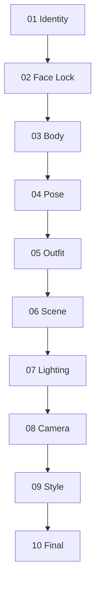

# Reference Fusion System

<p align="center">

使用模块化参考融合的 AI 图像制作工作流程。

</p>

---

## 🌐 Languages

[🇺🇸 English](README.md) | [🇹🇼 繁體中文](README_zh-TW.md) | [🇨🇳 简体中文](README_zh-CN.md) | [🇯🇵 日本語](README_ja.md)

---

## 什么是 RFW？

**Reference Fusion Workflow (RFW)** 是一个用于多模态图像生成的结构化、保持身份一致性的参考分配框架。

RFW 不会将多张参考图片混合到单个提示词中，而是为每张参考图片分配**一个明确的视觉责任**：

> **Identity → Body → Pose → Outfit → Scene → Lighting → Camera → Style**

通过隔离每个视觉属性，RFW 让角色生成更加可预测、可复现，并且更容易进行迭代。

**优势**

* 更一致的角色身份
* 可控的视觉编辑
* 减少参考冲突
* 更容易进行迭代优化

> 针对 **Nano Banana** 进行优化，但设计上适用于任何支持多张参考图片的图像模型，包括 **GPT Image**、**Flux Kontext**、**Gemini Image** 以及未来模型。

---

# 设计理念

RFW 遵循一个简单原则：

> **每张参考图片都应该具有且仅具有一个主要责任。**

当多张参考图片争夺相同视觉属性时，图像模型经常会产生不一致结果，包括身份漂移、身体变形或意外的风格迁移。

通过为每张参考图片分配单一责任，每个生成步骤都会变得更加可预测、模块化且可复现。

---

# 为什么需要这个系统

许多多参考工作流程会让每张参考图片同时承担多个视觉责任。

这通常会导致：

* 面部漂移
* 身体比例变化
* 服装特征渗入面部身份
* 场景参考覆盖角色
* 不可预测的生成结果

RFW 通过强制执行**顺序责任链**来解决这些问题，其中每个阶段只修改一个视觉维度，同时保留早期阶段建立的所有内容。

```
Identity → Face Lock → Body → Pose → Outfit → Scene → Lighting → Camera → Style → Final
```

早期阶段建立不可变的属性。

后续阶段只优化被隔离的视觉维度。

---

# 快速开始

1. 阅读 **docs/architecture.md** 以了解设计原则。
2. 按照 **docs/workflow.md** 执行工作流程。
3. 使用 **prompts/** 中的提示词（每个阶段一个文件）。
4. 如果出现问题，请参阅 **docs/failure-recovery.md**。

---

# 核心流程

每个阶段都会生成下一阶段可重复使用的 **Master Reference**。



| 阶段           | 责任      | 输出                      |
| ------------ | ------- | ----------------------- |
| 01 Identity  | 面部身份    | `Identity_Master_v1`    |
| 02 Face Lock | 恢复身份一致性 | `Face_Locked_Master_v1` |
| 03 Body      | 身体比例    | `Body_Master_v1`        |
| 04 Pose      | 身体位置与姿态 | `Pose_Master_v1`        |
| 05 Outfit    | 服装与配饰   | `Fashion_Master_v1`     |
| 06 Scene     | 环境      | `Scene_Master_v1`       |
| 07 Lighting  | 光线与氛围   | `Lighting_Master_v1`    |
| 08 Camera    | 镜头与构图   | `Camera_Master_v1`      |
| 09 Style     | 整体美学    | `Style_Master_v1`       |
| 10 Final     | 真实感增强   | `Final_Master_v1`       |

---

# Reference Priority Matrix

工作流程遵循一条规则：

> **每张参考图片拥有一个视觉责任。**

| 阶段        | 主要责任  | 保留       | 忽略        |
| --------- | ----- | -------- | --------- |
| Identity  | 面部身份  | —        | 其他所有内容    |
| Face Lock | 面部身份  | 身体、姿态、服装 | 背景        |
| Body      | 身体比例  | 面部与身份    | 身体参考图中的脸  |
| Pose      | 姿态与骨架 | 面部与身体    | 姿态参考图中的身份 |
| Outfit    | 服装    | 面部、身体与姿态 | 服装参考图中的脸  |
| Scene     | 环境    | 整个角色     | 场景参考图中的角色 |
| Lighting  | 光线与氛围 | 其他所有内容   | —         |
| Camera    | 构图    | 其他所有内容   | —         |
| Style     | 整体美学  | 其他所有内容   | —         |
| Final     | 图像质量  | 全部内容     | —         |

---

# Repository Structure

```
nano-banana-rfw/
├── README.md
├── prompts/
│   ├── 01_identity.md
│   ├── 02_face_lock.md
│   ├── 03_body.md
│   ├── 04_pose.md
│   ├── 05_outfit.md
│   ├── 06_scene.md
│   ├── 07_lighting.md
│   ├── 08_camera.md
│   ├── 09_style.md
│   └── 10_final.md
├── docs/
│   ├── architecture.md
│   ├── workflow.md
│   ├── failure-recovery.md
│   ├── best-practices.md
│   └── limitations.md
└── examples/
    ├── identity/
    ├── body/
    ├── pose/
    └── full-pipeline/
```

---

# 最佳实践

* 为每张参考图片分配一个责任。
* 尽可能使用高分辨率参考图片。
* 保持相近的相机角度和焦距。
* Identity 和 Body 参考应使用中性光线。
* 下一阶段始终将上一阶段的 **Master** 输出作为 Image 1。

更多建议请参阅 **docs/best-practices.md**。

---

# 限制

RFW 可以提升一致性，但无法保证：

* 所有图像模型都能完美保持身份
* 像素级精准复制服装
* 精确的手部或手指位置
* 完全相同的相机取景

结果取决于底层图像模型的能力以及参考图片的质量。

更多详细信息请参阅 **docs/limitations.md**。

---

# 贡献

欢迎提交贡献，包括：

* 改进提示词
* 恢复策略
* 模型专属建议
* 工作流程增强
* 文档改进

请保留核心设计原则：

> **一张参考图片。一项责任。**

---

*Reference Fusion Workflow (RFW) — 通过结构化参考分配实现一致角色生成。*
