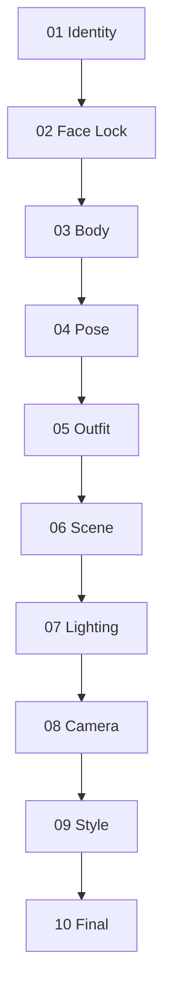

# Reference Fusion System

<p align="center">

使用模組化參考融合的 AI 影像製作工作流程。

</p>

---

## 🌐 Languages

[🇺🇸 English](README.md) | [🇹🇼 繁體中文](README_zh-TW.md) | [🇨🇳 简体中文](README_zh-CN.md) | [🇯🇵 日本語](README_ja.md)

---

## 什麼是 RFW？

**Reference Fusion Workflow (RFW)** 是一套用於多模態影像生成的結構化、保持身份一致性的參考分配框架。

RFW 不將多張參考圖片混合在單一提示詞中，而是為每張參考圖片分配**一個明確的視覺責任**：

> **Identity → Body → Pose → Outfit → Scene → Lighting → Camera → Style**

透過隔離每個視覺屬性，RFW 讓角色生成更加可預測、可重現，也更容易進行迭代。

**優點**

* 更一致的角色身份
* 可控的視覺編輯
* 減少參考衝突
* 更容易進行迭代優化

> 專為 **Nano Banana** 優化，但設計上可適用於任何支援多張參考圖片的影像模型，包括 **GPT Image**、**Flux Kontext**、**Gemini Image** 以及未來模型。

---

# 設計理念

RFW 遵循一個簡單原則：

> **每張參考圖片都應該具有且僅具有一個主要責任。**

當多張參考圖片爭奪相同視覺屬性時，影像模型經常會產生不一致結果，包括身份漂移、身體變形或非預期的風格轉移。

透過為每張參考圖片分配單一責任，每個生成步驟都會變得更加可預測、模組化且可重現。

---

# 為什麼需要這個系統

許多多參考工作流程會讓每張參考圖片同時承擔多個視覺責任。

這通常會導致：

* 臉部漂移
* 身體比例改變
* 服裝特徵滲入臉部身份
* 場景參考覆蓋角色特徵
* 不可預測的生成結果

RFW 透過強制執行**循序責任鏈**來解決這些問題，其中每個階段只修改一個視覺維度，同時保留早期階段建立的所有內容。

```
Identity → Face Lock → Body → Pose → Outfit → Scene → Lighting → Camera → Style → Final
```

早期階段建立不可變更的屬性。

後續階段只優化被隔離的視覺維度。

---

# 快速開始

1. 閱讀 **docs/architecture.md** 以了解設計原則。
2. 依照 **docs/workflow.md** 執行工作流程。
3. 使用 **prompts/** 中的提示詞（每個階段一個檔案）。
4. 如果遇到問題，請參閱 **docs/failure-recovery.md**。

---

# 核心流程

每個階段都會產生下一階段可重複使用的 **Master Reference**。



| 階段           | 責任      | 輸出                      |
| ------------ | ------- | ----------------------- |
| 01 Identity  | 臉部身份    | `Identity_Master_v1`    |
| 02 Face Lock | 恢復身份一致性 | `Face_Locked_Master_v1` |
| 03 Body      | 身體比例    | `Body_Master_v1`        |
| 04 Pose      | 身體位置與姿勢 | `Pose_Master_v1`        |
| 05 Outfit    | 服裝與配件   | `Fashion_Master_v1`     |
| 06 Scene     | 環境      | `Scene_Master_v1`       |
| 07 Lighting  | 光線與氛圍   | `Lighting_Master_v1`    |
| 08 Camera    | 鏡頭與構圖   | `Camera_Master_v1`      |
| 09 Style     | 整體美學    | `Style_Master_v1`       |
| 10 Final     | 真實感增強   | `Final_Master_v1`       |

---

# Reference Priority Matrix

工作流程遵循一項規則：

> **每張參考圖片擁有一個視覺責任。**

| 階段        | 主要責任  | 保留       | 忽略        |
| --------- | ----- | -------- | --------- |
| Identity  | 臉部身份  | —        | 其他所有內容    |
| Face Lock | 臉部身份  | 身體、姿勢、服裝 | 背景        |
| Body      | 身體比例  | 臉部與身份    | 身體參考圖中的臉  |
| Pose      | 姿勢與骨架 | 臉部與身體    | 姿勢參考圖中的身份 |
| Outfit    | 服裝    | 臉部、身體與姿勢 | 服裝參考圖中的臉  |
| Scene     | 環境    | 整個角色     | 場景參考圖中的角色 |
| Lighting  | 光線與氛圍 | 其他所有內容   | —         |
| Camera    | 構圖    | 其他所有內容   | —         |
| Style     | 整體美學  | 其他所有內容   | —         |
| Final     | 影像品質  | 全部內容     | —         |

---

# Repository Structure

```
nano-banana-rfw/
├── README.md
├── prompts/
│   ├── 01_identity.md
│   ├── 02_face_lock.md
│   ├── 03_body.md
│   ├── 04_pose.md
│   ├── 05_outfit.md
│   ├── 06_scene.md
│   ├── 07_lighting.md
│   ├── 08_camera.md
│   ├── 09_style.md
│   └── 10_final.md
├── docs/
│   ├── architecture.md
│   ├── workflow.md
│   ├── failure-recovery.md
│   ├── best-practices.md
│   └── limitations.md
└── examples/
    ├── identity/
    ├── body/
    ├── pose/
    └── full-pipeline/
```

---

# 最佳實踐

* 為每張參考圖片分配一個責任。
* 儘可能使用高解析度參考圖片。
* 保持相近的攝影角度與焦距。
* Identity 與 Body 參考應使用中性光線。
* 下一階段永遠將上一階段的 **Master** 輸出作為 Image 1。

更多建議請參閱 **docs/best-practices.md**。

---

# 限制

RFW 可以提升一致性，但無法保證：

* 所有影像模型都能完美保持身份
* 像素級精準重現服裝
* 精確的手部或手指位置
* 完全相同的鏡頭構圖

結果取決於底層影像模型的能力以及參考圖片的品質。

更多詳細資訊請參閱 **docs/limitations.md**。

---

# 貢獻

歡迎提交貢獻，包括：

* 改進提示詞
* 復原策略
* 模型專屬建議
* 工作流程增強
* 文件改進

請保留核心設計原則：

> **一張參考圖片。一項責任。**

---

*Reference Fusion Workflow (RFW) — 透過結構化參考分配實現一致角色生成。*
